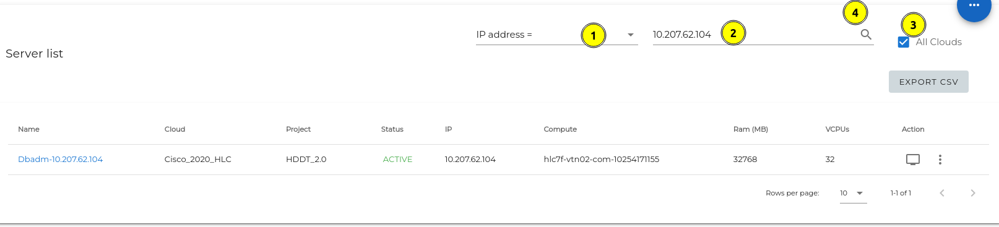
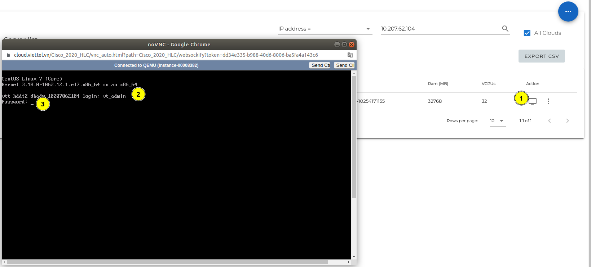
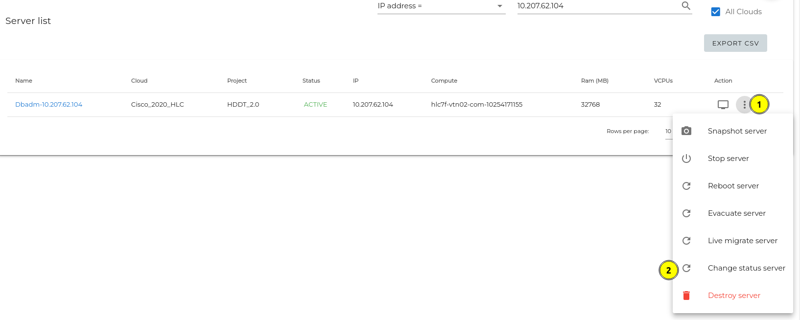
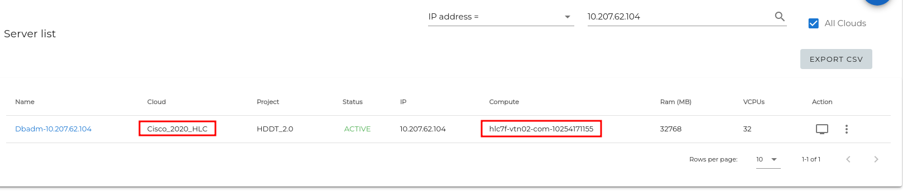
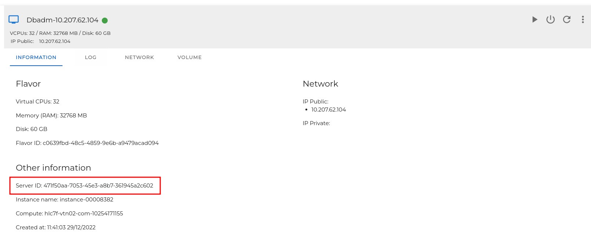

#### Bước 1: lên Multi Portal: https://cloud.viettel.vn/
Nhập IP của máy ảo bị down, tìm kiếm trên all cloud


####  Thực hiện kiểm tra bằng cách login vào giao diện Console của máy ảo nếu không ping/ssh được. Click Start nếu status máy ảo là shutdown



Thực hiện console vào máy chủ , nếu không thao tác được các phím ( Numlock và Caplock) thì là server đã treo. Nếu vẫn thao tác được, thì login bằng account/password vào server để kiếm tra tiếp.

#### Nếu kiểm tra thấy trạng thái của server là ERROR thực hiện các bước sau
Thực hiện Reset-state


Trạng thái chuyển về ACTIVE thực hiện restart server

Sau khi restart server mà server nếu trạng thái vẫn là ACTIVE thì đăng nhập để kiểm tra tiếp.

Nếu server trở lại trạng thái là ERROR thì thực hiện Evacuate.

Đợi trạng thái của server chuyển sang ACTIVE thì login vào server để kiểm tra tiếp.

#### REBUILD  trong trường hợp evalucate không thành công
Xác định  máy ảo đang nằm trên cloud nào


Lên giao diện horizon của cloud tương ứng check IFD của máy ảo cần rebuild


Sau khi có được ID của máy ảo, lên `Node manager` của cloud tương ứng (`10.255.77.2` or `10.254.170.5`) , chạy tool rebuild tại đường dẫn `/opt/cloud-script`
```
python recreate_vm.py Id_máy_ảo
```
